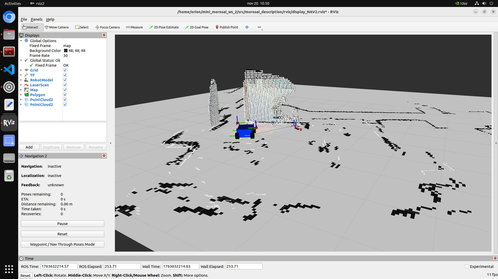
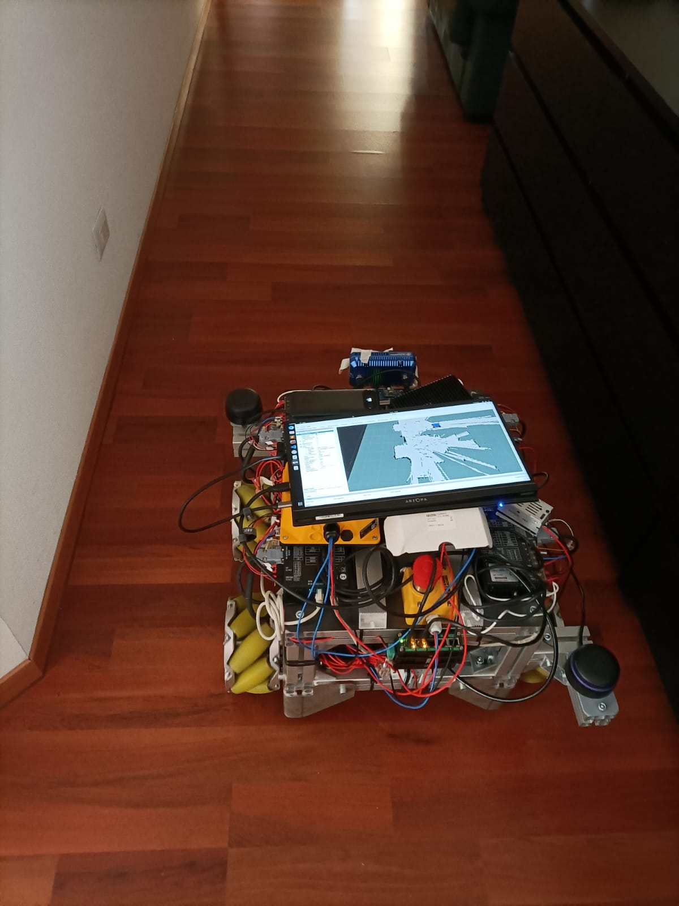
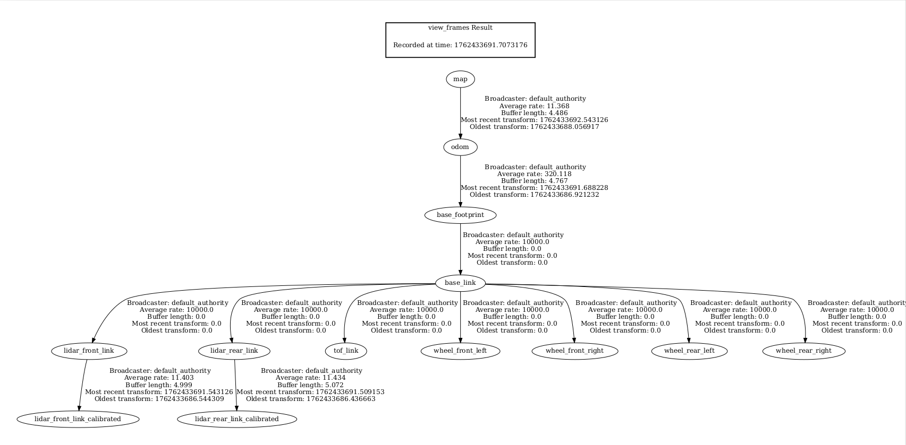

# MINI AGV – MOROSAI Project (ROS2 NAV2)

Questo README descrive il workspace `morosai_mini_ws` utilizzato per il MINI AGV del progetto MOROSAI. Il sistema integra sensori LIDAR, camera ToF, optical head e stack di navigazione NAV2 (ROS 2 Humble/Jazzy).

---

## 📁 Struttura del Workspace

Il workspace contiene i seguenti pacchetti:

```
src/
├── export_dependencies.sh    # Script per esportare dipendenze
├── morosai_bringup           # Launch principali del robot
├── morosai_description       # URDF, mesh, TF
├── morosai_navigation        # Config e launch di NAV2
├── morosai_sensors           # Driver e bridge sensori
├── optical_head              # Nodo e messaggi per testina ottica
├── tof_camera                # Driver ToF Gordon Quanergy
└── sllidar_ros2              # Driver RPLidar A3
```

---




---

## 🚀 Installazione

### 1. Creazione workspace

```
mkdir -p ~/morosai_mini_ws/src
cd ~/morosai_mini_ws
```

### 2. Clonazione pacchetti

Copia i pacchetti.

### 3. Installazione dipendenze

```
cd ~/morosai_mini_ws
rosdep install --from-paths src -y --ignore-src
```

Oppure utilizza:

```
bash src/export_dependencies.sh
```

### 4. Compilazione workspace

```
colcon build --symlink-install
source install/setup.bash
```

---

## 🤖 Morosai Bringup

Questo pacchetto lancia l'intero robot (sensori + TF + NAV2).

Esempio avvio:

```
ros2 launch morosai_bringup bringup_robot.launch.py
```

Contiene:

* TF tree completo del robot
* Driver sensori
* Parametrizzazione base

---

## 🗺️ Navigazione – NAV2

Il pacchetto `morosai_navigation` include:

* Configurazioni di costmap
* Parametri di planner e controller (DWB/SmacPlannerLattice)
* Launch file per mappatura e navigazione

### Avvio SLAM e Mappatura
Esistono 3 modi principali per utilizzare lo SLAM con il robot, a seconda del tuo obiettivo.

**1. Mappatura Manuale (Mapping ONLY)**
Usa questo file se vuoi guidare manualmente il robot (es. con il teleop) per costruire la mappa. Lancia solo i sensori e lo SLAM Toolbox, senza attivare Nav2:
```bash
ros2 launch morosai_navigation slam_mapping.launch.py 
```

**2. Esplorazione e Mappatura Autonoma (SLAM)**
Usa questo file se vuoi dare goal (su RViz2) al robot in aree non mappate, in modo che esplori e costruisca la mappa in modo autonomo:
```bash
ros2 launch morosai_bringup slam_bringup.launch.py
```

### 💾 Come Salvare (Serializzare) una Mappa
A differenza di AMCL, SLAM Toolbox in modalità localizzazione **non utilizza mappe immagine .pgm**. Richiede una mappa serializzata (un file `.posegraph`).

Una volta terminata la mappatura con uno dei comandi precedenti, apri un nuovo terminale ed esegui:
```bash
ros2 service call /slam_toolbox/serialize_map slam_toolbox/srv/SerializePoseGraph "{filename: '/home/orion/morosai_mini_ws/src/morosai_navigation/maps/nome_mia_mappa'}"
```
*Questo creerà i file `nome_mia_mappa.posegraph` e `nome_mia_mappa.data` nella cartella specificata.*

### 📍 Localizzazione SLAM
Una volta salvata la mappa serializzata, inserisci il path corretto verso la tua mappa (senza l'estensione `.posegraph`!) nel parametro `map_file_name` del file di configurazione `src/morosai_navigation/config/slam_toolbox_localization.yaml`.

Quindi, avvia il robot per navigare all'interno della mappa conosciuta:
```bash
ros2 launch morosai_bringup slam_localization_bringup.launch.py
```




---


---

## ⚙️ Configurazione Sensori

Tutti i parametri dei sensori (porte seriali, nomi dei nodi, frame TF) sono centralizzati in:  
`src/morosai_sensors/config/sensors.yaml`

### Struttura del file
Puoi modificare questo file per cambiare le porte USB senza toccare i launch file.
Esempio:

```yaml
lidar_front:
  node_name: sllidar_front
  serial_port: "/dev/serial/by-id/usb-Silicon_Labs_..."
  frame_id: lidar_front_link
```

**Nota:** Dopo aver modificato il file yaml, se hai usato `--symlink-install` le modifiche sono immediate. Altrimenti ricompila:
```bash
colcon build --packages-select morosai_sensors
```

---

## 🔧 Sensori

### RPLidar A3

Nodo: `sllidar_ros2`

```
ros2 launch sllidar_ros2 sllidar_launch.py
```

### Gordon Quanergy ToF Camera

Nodo: `tof_camera`

### Optical Head

Nodo per topic personalizzati: (`PgvScanData`)

---

## 🧪 Test rapidi

### Verifica sensori

```
ros2 topic list
ros2 topic echo /merged
```

### Verifica TF

```
ros2 run tf2_tools view_frames.py
```




---

## 🧭 Suggerimenti Utili

* Ricordati sempre di fare **source install/setup.bash** in ogni nuovo terminale.
* Usa `--symlink-install` per debug rapido dei file.
* Se NAV2 non riceve odometria → controlla `/odom` e `/tf`.
* Per registrare rosbag utili alla navigazione:

```
ros2 bag record /odom /scan /tf /tf_static /pointcloud /cmd_vel
```

---

## 📌 Autori

Progetto sviluppato all’interno del **MOROSAI Project**, con integrazione sensori e navigazione per MINI AGV.
